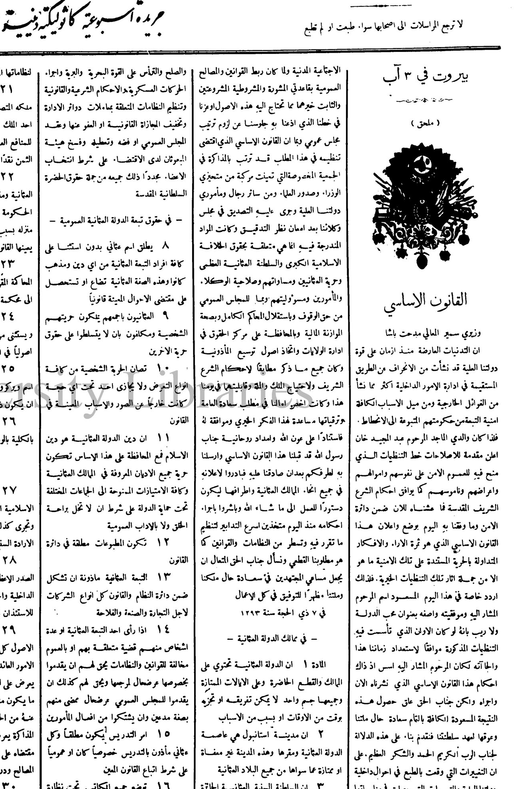
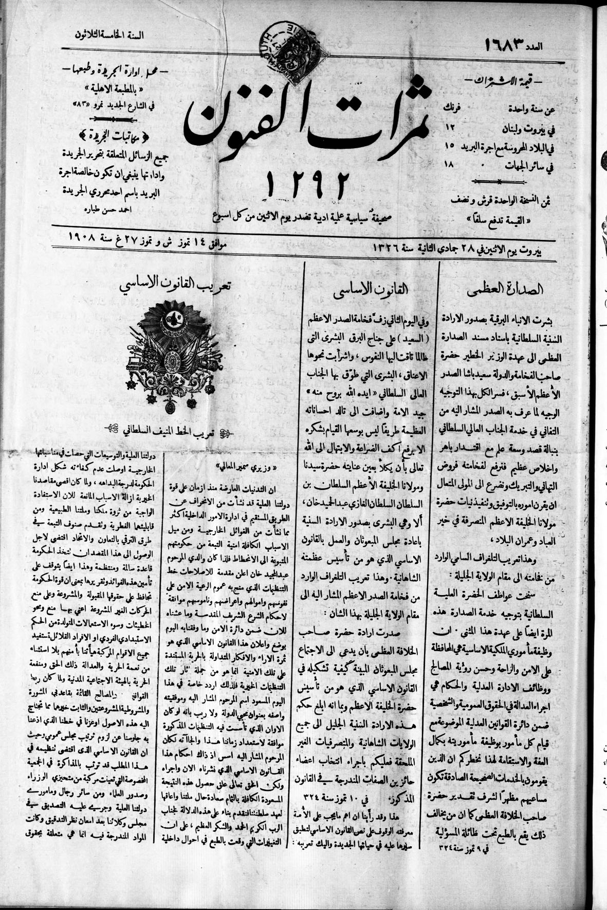
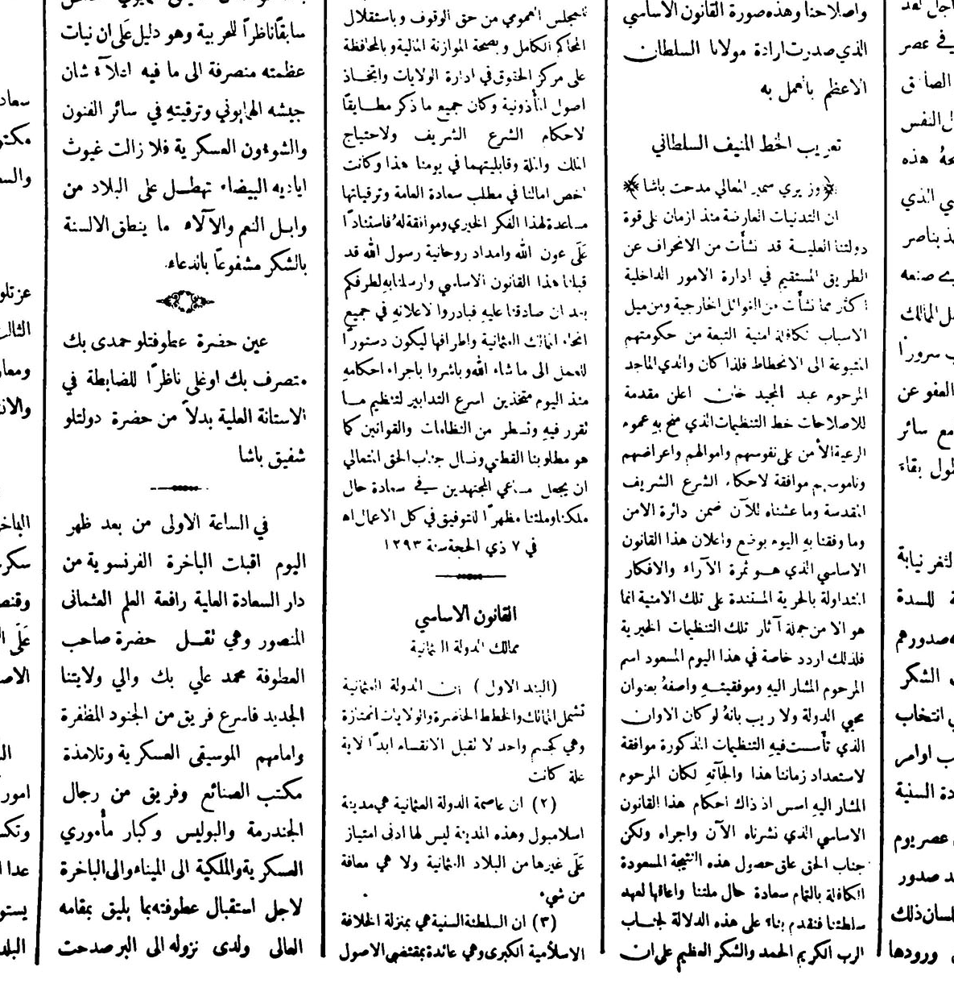
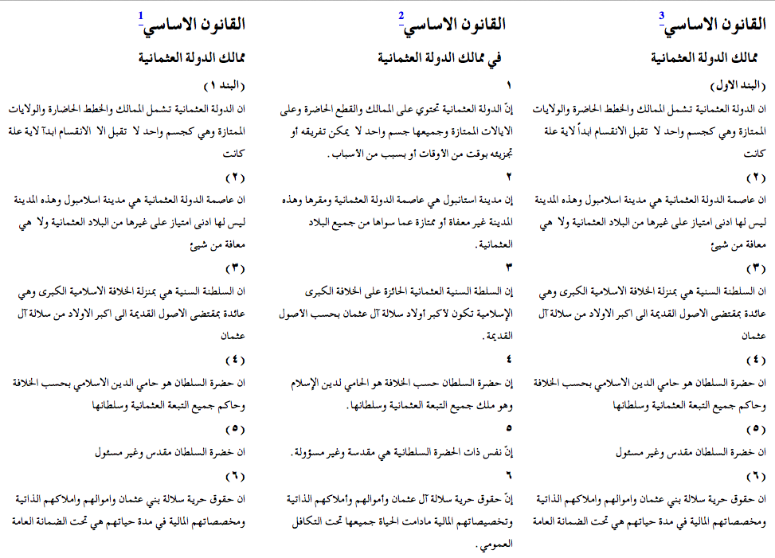

Many slides are based on those supplied by the various [Digital Humanities Summer Schools at the University of Oxford](http://digital.humanities.ox.ac.uk/dhoxss/) under the [Creative Commons Attribution](http://creativecommons.org/licenses/by/3.0/) license and have been adopted to the needs of introductory classes to TEI and Arabic texts at DHIB 2019, 2015, DHSI 2015, and Leipzig 2015.

Slides were produced using [MultiMarkdown](http://fletcherpenney.net/multimarkdown/), [Pandoc](http://johnmacfarlane.net/pandoc/), and [Slidy JS](https://www.w3.org/Talks/Tools/Slidy/slidy.js).

The slides are available at [https://www.github.com/tillgrallert/TeachingTei/slides/dhib-2019/](https://www.github.com/tillgrallert/TeachingTei/slides/dhib-2019/index.html).

# Content of this session

- What is a text?
- Introducing the idea of mark-up
- Introducing XML
- Introducing the TEI

# What is a text?




-------------------



-------------------




--------------------


-------------------




# A text is not a document

Where is the text?

- in the shape of letters and their layout?
- in the original from which this copy derives?
- in the stories we read into it?
- or in its author's intentions?

**TEI's definition**:

- A **"document"** is something that exists in the world, which we can **digitize**.
- A **"text"** is an abstraction, created by or for a community of readers,
which we can **encode**.

# Encoding of texts

- A text is more than a sequence of encoded glyphs or lexical tokens
    + It has a *structure* and a *communicative function*
    + It also has multiple possible *readings*
- Encoding, or mark-up, is a way of making these things explicit

Note: <hi class="cImportant">Only that which is explicit can be reliably found again and displayed</hi>

# Mark-up: What is the point?

- To make *explicit* (to a machine) what is *implicit* (to a person)
- To add value by supplying *multiple annotations*
- To facilitate *re-use* of the same material
    + in different formats
    + in different contexts
    + by different users

Note: <hi class="cImportant">We don't have to be limited to the view of one editor or consumer</hi>

<!--
# Mark-up: styles

- In the beginning there was *procedural* mark-up: `RED INK ON; print balance; RED INK OFF`
- which being generalised became *descriptive* or *semantic* mark-up: `<balance type="overdrawn">some numbers</balance>`
- also known as **encoding** or **annotation**

Note: <hi class="cImportant">descriptive mark-up allows for easier re-use of data</hi>
 -->

# Mark-up: separation of form and content

- *Presentational* mark-up cares more about fonts and layout than meaning
- *Descriptive* mark-up says what things are, and leaves the rendition of them for a separate step. This is also known as *encoding* or *annotation*
- Separating the form of something from its content makes its re-use more flexible
- It also allows easy changes of presentation across a large number of documents


# Mark-up: some more definitions

- mark-up makes explicit the distinctions we want to make when processing a string of bytes
- mark-up is a way of naming and characterising the parts of a text in a formalized way
- It's (usually) more useful to mark up what we think things *are* than what they *look* like


# Mark-up is a scholarly activity!

- The application of mark-up to a document can be an intellectual activity
- In deciding what mark-up to apply, and how this represents the original, one is undertaking the task of an editor
- There is (almost) no such thing as neutral mark-up -- all of it involves interpretation
- mark-up can assist in answering research questions, and deciding what mark-up is needed to enable such questions to be answered can be a research activity in itself
- Good textual encoding is never as easy or quick as people would believe
- Detailed document analysis is needed before encoding for the resulting mark-up to be useful

# The TEI

The Text Encoding Initiative (TEI) is a consortium which collectively develops and maintains a standard for the representation of texts in digital form. Its chief deliverable is a set of [Guidelines](http://www.tei-c.org/Guidelines/) which specify encoding methods for machine-readable texts chiefly in the humanities, social sciences and linguistics.

Established in 1987, the TEI adopted XML with P[roposal]4 in 2002.

# Why the TEI?

The TEI provides:

- a language-independent framework for defining markup languages
- a very simple consensus-based way of organizing and structuring textual (and other) resources...
- ... which can be enriched and personalized in highly idiosyncratic or specialised ways
- a very rich library of existing specialised components
- an integrated suite of standard stylesheets for delivering schemas and documentation in various languages and formats
- a large and active open source style user community

# Relevance

Why would you want those things?

- because we need to interchange resources
    + between people
    + (increasingly) between machines
- because we need to integrate resources
    + of different media types
    + from different technical contexts
- because we need to preserve resources
    + cryogenics is not the answer!
    + we need to preserve metadata as well as data

# XML: what it is and why you should care

- XML is *structured data* represented as strings of text encoded in Unicode
- XML looks like HTML, except that:
    + XML is *extensible*
    + XML must be *well-formed*
    + XML can be *validated*
- XML is application-, platform-, and vendor- independent
- XML empowers the *content provider* and facilitates data integration

# Characteristics of XML: internal structure

An XML document might contain:

+ **processing instructions**: e.g. ` <?xml version="1.0" encoding="UTF-8"?>`
+ **elements** (also: node(), tags) wrapped in angled brackets: `<node/>`. Nodes can carry attributes and contain a mix of text() and child elements.
+ **@attributes**: describe specific qualities of the element's content; attached to elements inside the angled brackets: `<node attribute1="someValue" attribute2="someOtherValue"/>`
+ **text()**: the content of a node; between the opening and closing element tag: `<node>Some text including whitespaces etc.</node>`
+ **entity references**: "escaped" characters; as & and < are special symbols, they cannot be used as they are but must be written as entity reference. All entity references start with & and end with ; E.g. `&amp;`, `&quot;`, `&lt;`, `&gt;`, `&apos;`
+ **CDATA**: All text is parsed, but text in `<![CDATA[` `]]>`
+ **namespaces**: differentiate XML schemas by means of an URI

# Characteristics of XML: rules

- All (sic!) data is encoded in Unicode (UTF-8 or UTF-16)
- **must** be well-formed:
    + nodes can only nest,
    + all nodes/elements must be closed,
    + element / attribute names and values are case-sensitive,
    + the document contains only a single *root* node
- **can** be validated against schema(s)
   + can contain xml valid against different schemas if differentiated by *namespaces*
- can be styled for display in a web-browser using CSS (Cascading Style Sheets). Most web-browsers can also transform XML on the fly with XSLT 1.

# Characteristics of XML: schemas and namespaces

+ Informally, a *namespace* is a way of identifying the provenance of a bunch of elements: a schema does the same, but it also specifies some rules about how those elements should be used.
+ a *schema* allows you to
    * ensure that your documents use only predefined elements, attributes, and entities
    * enforce structural rules such as "every chapter must begin with a heading" or "recipes must include an ingredient list"
+ a namespace is just a URI; a schema is a formal specification written in a formal language

# Our first complete XML document:

```xml
<?xml version="1.0"?>
<greetings xmlns="http://www.example.org/greetings">
    <hello type="enthusiastic">hello world!</hello>
</greetings>
```

- The XML declaration: `<?xml version="1.0"?>`
- Namespace declarations: `@xmlns="http://www.example.org/greetings"`
- The root element of the document itself: `<greetings>`
- Other elements and content: `<hello>hello world!</hello>`
- Attribute and value: `@type="enthusiastic"`


# Characteristics of TEI XMl in one slide

- all of XML
- *must* be valid against the schema TEI all
  + TEI all: `<?xml-model href="http://www.tei-c.org/release/xml/tei/custom/schema/relaxng/tei_all.rng" type="application/xml" schematypens="http://relaxng.org/ns/structure/1.0"?>`
  + "valid": the XML adheres to a specific schema, a set of conventions that tell the computer as well as the human reader about the structure of the element and the data to be expected at any given point in the document.
  + this provides *interchangability* and a certain degree of *interoperability* (the letter is often only theoretically applicable)

# Conformance issues

A document is *TEI Conformant* if and only if it:

- is a well-formed XML document
- can be validated against a TEI Schema, that is, a schema derived from the TEI Guidelines
- conforms to the TEI Abstract Model
- uses the TEI Namespace (and other namespaces where relevant) correctly
- is documented by means of a TEI Conformant ODD file which refers to the TEI Guidelines

or if it can be transformed automatically using some TEI-defined procedures into such a document (it is then considered *TEI-conformable*).

# A final note on standardisation

Standardisation should not mean "Do what I do", but rather <hi class="cImportant">"Explain what you do in terms I can understand".</hi>

Instead of an abstract set of rules and norms, standardisation should be thought of as a <hi class="cImportant">community of practice.</hi>


# Editing XML 1/2

- as a hermeneutic tool, XML could be written with pen and paper
- on a computer it can be edited with the most simple text editing software
- in order to get the most out of it, the editor should be *syntax aware* (and thus support *code highlighting*) and *schema aware* (i.e. validate the XML against a schema and suggest available elements and attributes on the basis of that schema)

# Editing XML 2/2: software

- **oXygen** is the quasi-standard for editing and processing XML files and it comes with TEI support built-in. Unfortunately, oXygen is neither open-source nor free and licenses can be costly. I would nevertheless suggest that everyone signs up for a one-month trial.
    + provides an "author" mode that does shows only the text inside notes, styled according to CSS associated to a specific schema
    + has an XSLT processor built-in
    + supports XQuery and XML databases
- **Sublime Text** is a superb text editor for programmers that provides an unlimited trial period. It is syntax aware and can render Arabic with the help of the following plug-in:
    + [https://github.com/praveenvijayan/Sublime-Text-2-BIDI](https://github.com/praveenvijayan/Sublime-Text-2-BIDI) **CAUTION**: the plug-in rearranges Arabic to make it look correct, but the actual order of characters in the file is changed and wrong.

# Useful links / resources

- the TEI Consortium's [website](http://www.tei-c.org/index.xml) at http://www.tei-c.org/index.xml:
    + the [TEI guidelines](http://www.tei-c.org/Guidelines/P5/) at http://www.tei-c.org/Guidelines/P5/
    + [TEI by Example](http://www.teibyexample.org/TBE.htm) at http://www.teibyexample.org/TBE.htm
    + the TEI mailing list, <TEI-L@LISTSERV.BROWN.EDU>
    + the [TEI wiki](http://wiki.tei-c.org/index.php) at http://wiki.tei-c.org/: comprising inter alia [TEI cheatsheets](http://wiki.tei-c.org/index.php/TEI_Cheatsheets) at http://wiki.tei-c.org/index.php/TEI_Cheatsheets.
- Further resources provided by the TEI council and Oxford computing centre:
    + [ROMA](http://www.tei-c.org/Roma/) at http://www.tei-c.org/Roma/: customising TEI schemas for XML validation
    + [OxGarage](http://oxgarage.oucs.ox.ac.uk:8080/ege-webclient/) at http://oxgarage.oucs.ox.ac.uk:8080/ege-webclient/: online resource for conversion between common file formats, using TEI P5 as pivot format. Can be used to produce TEI P5 XML from a .docx file.
    + [DHOxSS](http://digital.humanities.ox.ac.uk/dhoxss/) at http://digital.humanities.ox.ac.uk/dhoxss/: providing the material (including slides and exercises) for years of summer schools.