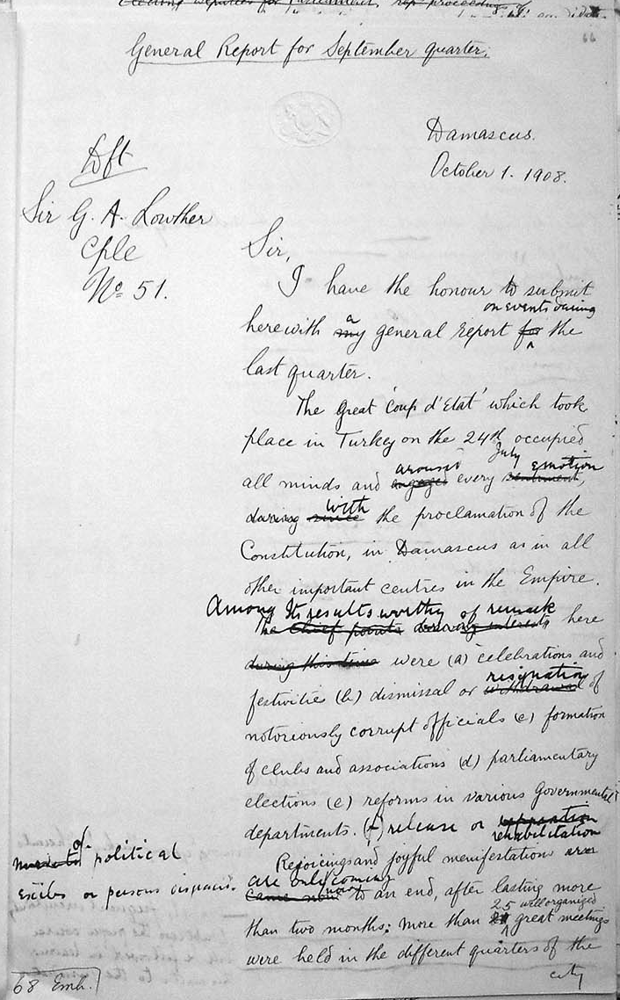
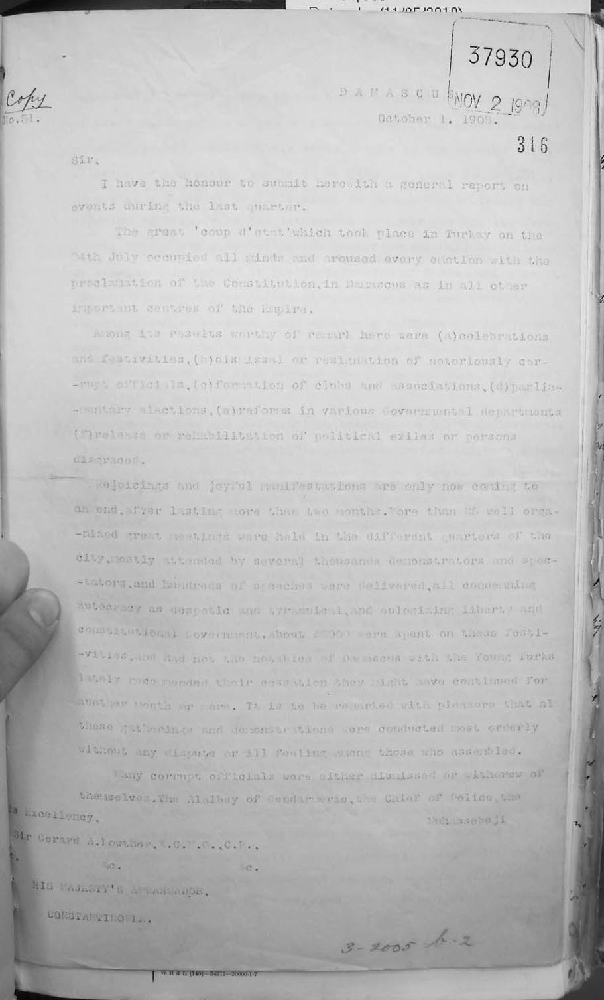
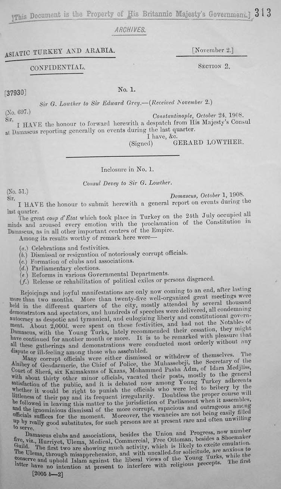
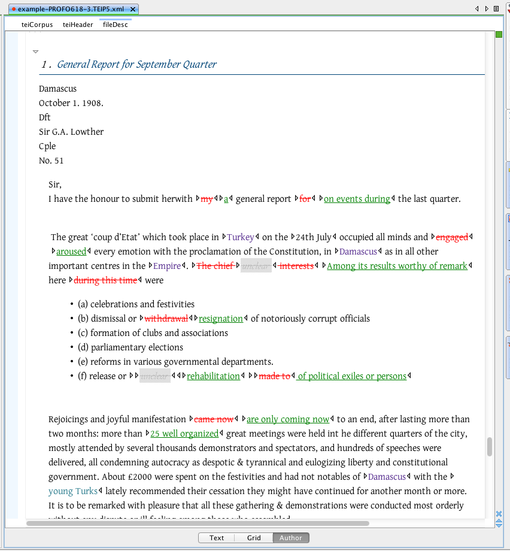

# Introduction to Markup, XML, and the TEI

The slides are based on those supplied by the various [Digital Humanities Summer Schools at the University of Oxford](http://digital.humanities.ox.ac.uk/dhoxss/) under the [Creative Commons Attribution](http://creativecommons.org/licenses/by/3.0/) license and have been adopted to the needs of the 2015 Introduction to TEI at DHSI.

Slides were produced using [MultiMarkdown](http://fletcherpenney.net/multimarkdown/), [Pandoc](http://johnmacfarlane.net/pandoc/), [Slidy JS](https://www.w3.org/Talks/Tools/Slidy/slidy.js), and the [Snippet](http://steamdev.com/snippet/) jQuery Syntax highlighter.

# Textual Markup

In order to talk about texts, markup and encoding of texts, we need to understand what we mean by these basic concepts.

When we talk about text encoding, what do we mean by a *text*? What is in a text and which assumptions do we make in reading them?

# What is a text?

Is this text ...



-------------------

... the same as this text ...



-------------------

... the same as this text ...



-------------------

... the same as this text?



# A text is not a document

Where is the text?

- in the shape of letters and their layout?
- in the original from which this copy derives?
- in the stories we read into it?
- or in its author's intentions?

**TEI's definition**:

- <hi style="color:red">A "document" is something that exists in the world, which we can **digitize**</hi>.
- <hi style="color:red">A "text" is an abstraction, created by or for a community of readers,
which we can **encode**</hi>.

# Encoding of texts

- A text is more than a sequence of encoded glyphs or lexical tokens
    + It has a *structure* and a *communicative function*
    + It also has multiple possible *readings*
- Encoding, or markup, is a way of making these things explicit
- <hi style="color:red">Only that which is explicit can be reliably found again and displayed</hi>

# What is the point of markup?

- To make *explicit* (to a machine) what is *implicit* (to a person)
- To add value by supplying *multiple annotations*
- To facilitate *re-use* of the same material
    + in different formats
    + in different contexts
    + by different users
- <hi style="color:red">We don't have to be limited to the view of one editor or consumer</hi>

# Styles of markup

- In the beginning there was *procedural* markup: `RED INK ON; print balance; RED INK OFF`
- which being generalised became *descriptive* or *semantic* markup: `<balance type='overdrawn'>some numbers</balance>`
- also known as **encoding** or **annotation**
<hi style="color:red">descriptive markup allows for easier re-use of data</hi>

# Some more definitions

- Markup makes explicit the distinctions we want to make when processing a string of bytes
- Markup is a way of naming and characterizing the parts of a text in a formalized way
- It's (usually) more useful to markup what we think things *are* than what they *look* like

# Separation of form and content

- *Presentational* markup cares more about fonts and layout than meaning
- *Descriptive* markup says what things are, and leaves the rendition of them for a separate step
- Separating the form of something from its content makes its re-use more flexible
- It also allows easy changes of presentation across a large number of documents

# Markup as scholarly activity

- The application of markup to a document can be an intellectual activity
- In deciding what markup to apply, and how this represents the original, one is undertaking the task of an editor
- There is (almost) no such thing as neutral markup -- all of it involves interpretation
- Markup can assist in answering research questions, and deciding what markup is needed to enable such questions to be answered can be a research activity in itself
- Good textual encoding is never as easy or quick as people would believe
- Detailed document analysis is needed before encoding for the resulting markup to be useful

# Compare markup

Example 1:

```xml
<hi rend="dropcap">H</hi>&WYN;ÆT WE GARDE <lb/>na in gear-dagum þeod-cyninga <lb/>þrym gefrunon, hu ða æþelingas <lb/>ellen fremedon. oft scyld scefing sceaþe <add>na</add>
<lb/>þreatum, moneg<expan>um</expan> mægþum meodo-setl <add>a</add>
<lb/>of<damage>
<desc>blot</desc> </damage>teah ...
```

Example 2:

```xml
<lg>
    <l>Hwæt! we Gar-dena in gear-dagum</l>
    <l>þeod-cyninga þrym gefrunon,</l>
    <l>hu ða æþelingas ellen fremedon,</l>
</lg>
<lg>
    <l>Oft Scyld Scefing sceaþena þreatum,</l>
    <l>monegum mægþum meodo-setla ofteah;</l>
    <l>egsode Eorle, syððan ærest wearþ</l>
    <l>feasceaft funden...</l>
</lg>
```

# A useful mental exercise

Imagine you are going to markup several thousand pages of complex material....

- Which features are you going to markup?
- Why are you choosing to markup this feature?
- How reliably and consistently can you do this?

Now, imagine your budget has been halved. Repeat the exercise!

# Some alphabet soup

|   abbr  |                        expan                         |
|---------|------------------------------------------------------|
| SGML    | Standard Generalized Markup Language                 |
| HTML    | Hypertext Markup Language                            |
| W3C     | World Wide Web Consortium                            |
| XML     | eXtensible Markup Language                           |
| DTD     | Document Type Definition (or Declaration)            |
| CSS     | Cascading Style Sheet                                |
| Xpath   | XML Path Language                                    |
| XSLT    | eXtensible Stylesheet Language - Transformations     |
| XQuery  | XML Querying                                         |
| RELAXNG | Regular Expression Language for XML (New Generation) |

... and then there's also <hi style="color:red">TEI, the Text Encoding Initiative</hi>

# XML

Extensible Markup Language (XML) is a simple, very flexible text format derived from SGML (ISO 8879). Originally designed to meet the challenges of large-scale electronic publishing, XML also now plays an indispensible role in the exchange of a wide variety of data on the Web and elsewhere.

# XML: what it is and why you should care

- XML is *structured data* represented as strings of text
- XML looks like HTML, except that:
    + XML is *extensible*
    + XML must be *well-formed*
    + XML can be *validated*
- XML is application-, platform-, and vendor- independent
- XML empowers the *content provider* and facilitates data integration

# XML terminology 1

An XML document may contain:

- processing instructions: e.g. ` <?xml version="1.0" encoding="UTF-8"?>`
- elements (also: node(), tags) wrapped in angled brackets: `<node/>`. Nodes can carry attributes and contain a mix of text() and child elements.
- @attributes: describe specific qualities of the element's content; attached to elements inside the angled brackets: `<node attribute1="someValue" attribute2="someOtherValue"/>`
- text(): the content of a node; between the opening and closing element tag: `<node>Some text including whitespaces etc.</node>`
- entity references: "escaped" characters; as & and < are special symbols, they cannot be used as they are but must be written as entity reference. All entity references start with & and end with ; E.g. `&amp;`, `&quot;`, `&lt;`, `&gt;`, `&apos;`
- CDATA: All text is parsed, but text in `<![CDATA[` `]]>`
- namespaces

# XML terminology 2

- The data is encoded in Unicode (UTF-8 or UTF-16)
- *must* be well-formed:
    + nodes can only nest,
    + all nodes/elements must be closed,
    + the document contains only a single *root* node
- *can* be validated against schema(s)
   + can contain xml valid against different schemas if differentiated by *namespaces*

# The rules of the XML Game

- An XML document represents a (kind of) *tree*
- It has a single *root* and many nodes
- Each node can be
    + a subtree
    + a single *element* (possibly bearing some *attributes*)
    + a string of *character data*
- Each element has a name or *generic identifier*
- XML elements and attributes are *case sensitive*

# Representing an XML tree

<!-- somewhat redundant with the ealier slide "XMl terminology 1" -->

- An XML document is encoded as a linear string of unicode characters
- It begins with a special *processing instruction*
- Element occurrences are marked by *start-* and *end-tags*
- The characters < and & are Magic and must always be "escaped" if you want to use them as themselves, i.e. `&lt;` and `&amp;`
- Comments are delimited by `<!-- and -->`
- Attribute name=value pairs are supplied on the start-tag and may be given in any order, separated by spaces
- Entity references (eg &lt; for < or &#199; for Ç) are delimited by & and ;
CDATA sections are delimited by `<![CDATA[ and ]]>` (but we won't use these here)

# Parts of a real XML document

```xml
<?xml version="1.0"?>
<greetings xmlns="http://www.example.org/greetings">
    <hello type="enthusiastic">hello world!</hello>
</greetings>
```

- The XML declaration
- Namespace declarations
- The root element of the document itself
- Other elements and content
- Attribute and value

# The XML declaration

An XML document must begin with an XML declaration which does three things:

- specifies that this *is* an XML document
- specifies which version of the XML standard it follows
- specifies which character encoding the document uses; the default, and recommended, encoding is 'UTF-8' (Unicode)

Example:

```xml
<?xml version="1.0" ?>
<?xml version="1.0" encoding="iso-8859-1" ?>
```

# Declaring namespaces

All TEI documents are declared within the TEI namespace — a way of distinguishing one set of elements from another with the same names (like `<p>`):

```xml
<TEI xmlns="http://www.tei-c.org/ns/1.0"> ... </TEI>
```

XML documents can include elements declared in different namespaces.

- a namespace declaration associates a namespace prefix with an external URI-like identifier
- the default namespace may be declared using an xmlns
- other name spaces must all use a specially declared prefix

Example:


The xml namespace is used by the TEI for global attributes `@xml:id` and `@xml:lang`

# Example: *Kawkab America* #55, 28 April 1893

```xml
<?xml version="1.0" encoding="UTF-8"?>
<div type="article" xml:lang="en">
  <head xml:lang="ar">الشرق في معرض <placeName>شيكاغو</placeName></head>
  <head xml:lang="en">The orient at fair.</head>
  <p>Is there anybody left in <placeName>Syria</placeName>, <placeName>Egypt</placeName>,
        <lb/><placeName>Turkey</placeName>, <placeName>Morocco</placeName>, and the other countries
        <lb/>of the Orient? Were the questions asked
        <lb/>by officers at <placeName>Ellis Island</placeName> and the Orient
        <lb/>als of <placeName>New York</placeName> within the last few
        <lb/>weeks. The long expected concessioners,
        <lb/>exhibitors and participants in the <orgName>World's
        <lb/>Fair</orgName>, who for many days and weeks have
        <lb/>been directing their footsteps from the
        <lb/>various lands of the rising sun towards
        <lb/>the "<q>new land of promise</q>" have arrived
        <lb/>in large numbers, and set foot upon the
        <lb/>soil of the new world which they have
        <lb/>sought with feelings of high expectation,
        <lb/>and an eagerness to which long distance
        <lb/>had added many charms. The Sheikh
        <lb/>who from childhood hours had learned to
        <lb/>praise Allah for every blessing of life,
        <lb/>must have shouted a hearty "<quote>Alhamduli
        <lb/>la! and Allah<gap/> Kariem!</quote>" when after a
        <lb/>journey of some weeks and months by
        <lb/>land and by sea he saw in <placeName>New York</placeName> har
        <lb/>bor the majestic form of the Goddess of
        <lb/>Liberty with the beacon of light in her
        <lb/>outstretched hand bidding him welcome
        <lb/>to the "<q>home of the brave and the land of
        <lb/>the free.</q>"</p>
</div>
```

# Example deconstructed: root node

```xml
<?xml version="1.0" encoding="UTF-8"?>
<div type="article" xml:lang="en">
    <!-- ... -->
</div>
```

# Example deconstructed: head

```xml
<head xml:lang="ar">الشرق في معرض <placeName>شيكاغو</placeName></head>
<head xml:lang="en">The orient at fair.</head>
```

# Example deconstructed: paragraph, quotes, and named entities

```xml
<p>Is there anybody left in <placeName>Syria</placeName>, <placeName>Egypt</placeName>,
<lb/><placeName>Turkey</placeName>, <placeName>Morocco</placeName>, and the other countries
<lb/>of the Orient? Were the questions asked
<lb/>by officers at <placeName>Ellis Island</placeName> and the Orient
<lb/>als of <placeName>New York</placeName> within the last few
<lb/>weeks. The long expected concessioners,
<lb/>exhibitors and participants in the <orgName>World's
<lb/>Fair</orgName>, who for many days and weeks have
<lb/>been directing their footsteps from the
    <!-- ... -->
<lb/>had added many charms. The Sheikh
<lb/>who from childhood hours had learned to
<lb/>praise Allah for every blessing of life,
<lb/>must have shouted a hearty "<quote>Alhamduli
<lb/>la! and Allah<gap/> Kariem!</quote>" when after a
    <!-- ... -->
<lb/>outstretched hand bidding him welcome
<lb/>to the "<q>home of the brave and the land of
<lb/>the free.</q>"</p>
```

# XML syntax: the small print

What does it mean to be **well-formed**?

1. There is a single root node containing the whole of an XML document
2. Each subtree is properly nested within the root node
3. Element/attribute/etc. names are always case sensitive
4. Start-tags and end-tags are always mandatory (except there is a combined start-and-end tag, e.g. `<pb/>`)
5. Attribute values are always quoted

A file can be **valid** in addition to being well-formed. This means
you obey the rules of a specified schema, such as the TEI.

# Test your XML knowledge

Which are correct?

```xml
 <seg>some text</seg>
 <seg> <foo>some</foo> <bar>text</bar> </seg>
 <seg> <foo>some <bar></foo> text</bar> </seg>
 <seg type="text">some text</seg>
 <seg type='text'>some text</seg>
 <seg type=text>some text</seg>
 <seg type="text"> some text <seg/>
 <seg type="text"> some text<gap/> </seg>
 <seg type="text">some text</Seg>
```

# XML is an international standard

- XML requires use of ISO 10646 (also known as Unicode)
    - a 31 bit character repertoire including most human writing systems
    - encoded as UTF8 or UTF16
- other encodings may be specified at the document level
- language may be specified at the element level using `@xml:lang`

(The `@xml:id` attribute is another W3C-defined attribute.)


# The TEI

The Text Encoding Initiative (TEI) is a consortium which collectively develops and maintains a standard for the representation of texts in digital form. Its chief deliverable is a set of Guidelines which specify encoding methods for machine-readable texts chiefly in the humanities, social sciences and linguistics.

# 1987 was a long time ago...

The Text Encoding Initiative was born into a very different world

- the world wide web did not exist
- the tunnel beneath the English Channel was still being built
- a state called the Soviet Union had just launched a space station called Mir
- serious computing was done on mainframes
- most people didn't have mobile phones

# ...but also a familiar problems

- Corpus linguistics and 'artificial intelligence' had created a demand for large scale lexical resources in academia and beyond
- Advances in text processing were beginning to affect lexicography and document management systems (e.g. TeX, Scribe, tRoff..)
- The Internet existed and theories about how to use it 'hypertextually' abounded
- Books, articles, and even courses in something called "Computing in the Humanities" were becoming commonplace

# The birth of the Text Encoding Initiative

- Spring 1987: European workshops on standardisation of historical data (J.P. Genet, M. Thaller )
- Autumn 1987: In the US, the NEH funds an exploratory international workshop on the feasibility of defining "text encoding guidelines"
- this resulted in the "Poughkeepsie principles"
- Summer 1990: first draft (*P1*, with the 'P' standing for proposal ever since) of guidelines circulated

# TEI is old!

- So the TEI is *very old*!
- It comes from a time before the Web, before the DVD, smart mobile phones, cable tv, the iPod, and *even XML* (which was finalised in 1998)!
- Not much in computing survives 5 years, never mind 25
- Why is it still here, and how has it survived?
- What relevance can it possibly have today?

# Why the TEI

The TEI provides

- a language-independent framework for defining markup languages
- a very simple consensus-based way of organizing and structuring textual (and other) resources...
- ... which can be enriched and personalized in highly idiosyncratic or specialised ways
- a very rich library of existing specialised components
- an integrated suite of standard stylesheets for delivering schemas and documentation in various languages and formats
- a large and active open source style user community

# Relevance

Why would you want those things?

- because we need to interchange resources
    + between people
    + (increasingly) between machines
- because we need to integrate resources
    + of different media types
    + from different technical contexts
- because we need to preserve resources
    + cryogenics is not the answer!
    + we need to preserve metadata as well as data

# The scope of intelligent markup

Even within the original scope of the TEI we have

- basic structural and functional components
- diplomatic transcription, images, annotation
- links, correspondence, alignment
- data-like objects such as dates, times, places, persons, events (named entity recognition)
- meta-textual annotations (correction, deletion, etc) linguistic analysis at all levels
- contextual metadata of all kinds
- ... and so on and so forth

# Reasons for attempting to define a common framework

- re-usability and repurposing of resources
- modular software development
- lower training costs
- 'frequently answered questions'---common technical solutions for different application areas

The TEI was designed to support multiple views of the same
resource. The TEI is an evolving model of the concerns of Digital Humanities.

<!-- # Purpose of the guidelines

- guidance for individual or local practice in text creation and data capture;
- support of data interchange;
- support of application-independent local processing. -->

# TEI adopted XML

In 2002, the TEI consortium published the P4 Guidelines, which were essentially an adaptation of P3 to XML that had been finalised as W3C standard in 1998.

P5, a complete overhaul of the guidelines, was published in 2008. Updates are regularly published every couple of months ever since. The current version 2.8.0 was released on 6 April 2015.

The Guidelines are currently maintained as an open source project on the Sourceforge site [http://tei.sf.net/](http://tei.sf.net/), from which released and development versions may be freely downloaded.

# TEI XML

- all of XML.
- In addition, TEI XML *must* be valid against the schema "TEI all"
    + TEI all: `<?xml-model href="http://www.tei-c.org/release/xml/tei/custom/schema/relaxng/tei_all.rng" type="application/xml" schematypens="http://relaxng.org/ns/structure/1.0"?>`
    + this *processing instruction* means that the XML adheres to a specific schema, a set of conventions that tell the computer as well as the human reader about the structure of the element and the data to be expected at any given point in the document.
    + this provides *interchangability* and a certain degree of *interoperability* (the latter is often only theoretically applicable)

# Note: namespaces vs schemas

+ a *namespace* is a way of identifying the provenance of a bunch of elements: a schema does the same, but it also specifies some rules about how those elements should be used.
+ a *schema* allows you to
    * ensure that your documents use only predefined elements, attributes, and entities
    * enforce structural rules such as 'every chapter must begin with a heading' or 'recipes must include an ingredient list'
+ a namespace is just a URI; a schema is a formal specification written in a formal language

# Conformance issues

A document is *TEI Conformant* if and only if it:

- is a well-formed XML document
- can be validated against a TEI Schema, that is, a schema derived from the TEI Guidelines
- conforms to the TEI Abstract Model
- uses the TEI Namespace (and other namespaces where relevant) correctly
- is documented by means of a TEI Conformant ODD file which refers to the TEI Guidelines

or if it can be transformed automatically using some TEI-defined procedures into such a document (it is then considered *TEI-conformable*).

# A final note on standardization

Standardization should not mean "Do what I do", but rather <hi style="color:red">"Explain what you do in terms I can understand".</hi>

Instead of an abstract set of rules and norms, standardisation should be thought of as a <hi style="color:red">community of practice.</hi>


# Useful links / resources

- the TEI Consortium's [website](http://www.tei-c.org/index.xml) at http://www.tei-c.org/index.xml:
    + the [TEI guidelines](http://www.tei-c.org/Guidelines/P5/) at http://www.tei-c.org/Guidelines/P5/
    + [TEI by Example](http://www.teibyexample.org/TBE.htm) at http://www.teibyexample.org/TBE.htm
    + the TEI mailing list, <TEI-L@LISTSERV.BROWN.EDU>
    + the [TEI wiki](http://wiki.tei-c.org/index.php) at <http://wiki.tei-c.org/>: comprising inter alia [TEI cheatsheets](http://wiki.tei-c.org/index.php/TEI_Cheatsheets) at http://wiki.tei-c.org/index.php/TEI_Cheatsheets.
- Further resources provided by the TEI council and Oxford computing centre:
    + [ROMA](http://www.tei-c.org/Roma/) at http://www.tei-c.org/Roma/: customising TEI schemas for XML validation
    + [OxGarage](http://oxgarage.oucs.ox.ac.uk:8080/ege-webclient/) at http://oxgarage.oucs.ox.ac.uk:8080/ege-webclient/: online resource for conversion between common file formats, using TEI P5 as pivot format. Can be used to produce TEI P5 XML from a .docx file.
    + [DHOxSS](http://digital.humanities.ox.ac.uk/dhoxss/) at http://digital.humanities.ox.ac.uk/dhoxss/: providing the material (including slides and exercises) for years of summer schools.
- [TEI Boilerplate](http://dcl.ils.indiana.edu/teibp/) at http://teiboilerplate.org/: a leight-weight solution for publishing styled TEI P5 content directly in modern web browsers.
