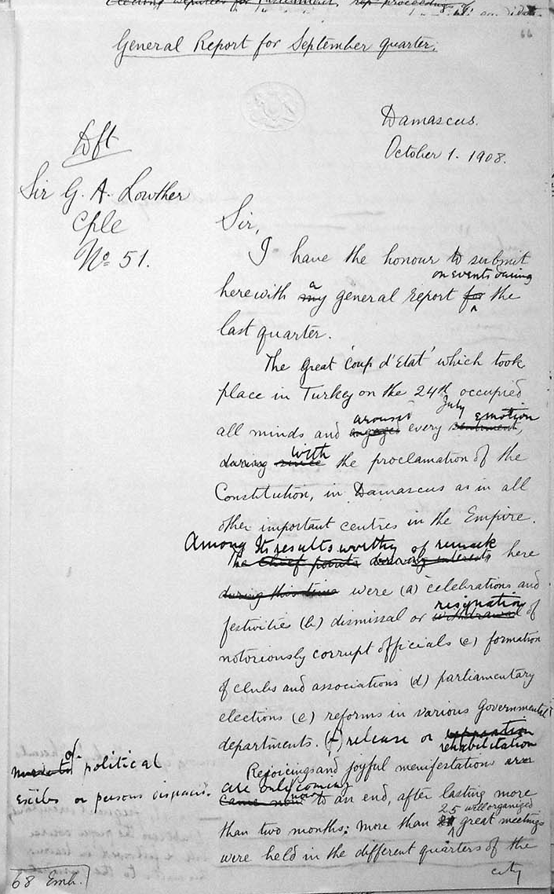
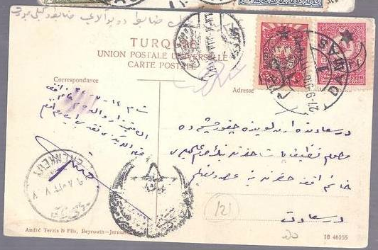
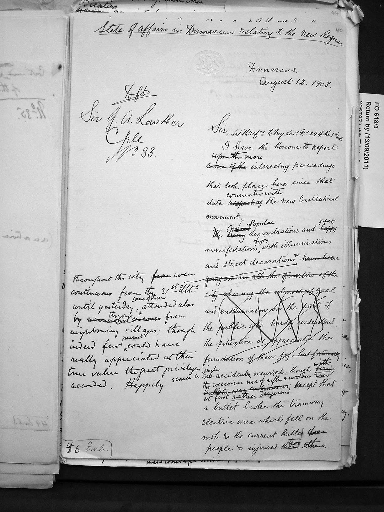
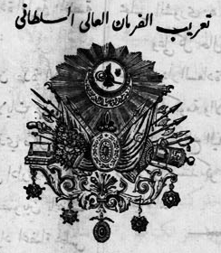

# TEI core module: Introducing structural markup

The slides are based on those supplied by the various [Digital Humanities Summer Schools at the University of Oxford](http://digital.humanities.ox.ac.uk/dhoxss/) under the [Creative Commons Attribution](http://creativecommons.org/licenses/by/3.0/) license and have been adopted to the needs of the 2015 Introduction to TEI at DHSI.

Slides were produced using [MultiMarkdown](http://fletcherpenney.net/multimarkdown/), [Pandoc](http://johnmacfarlane.net/pandoc/), [Slidy JS](https://www.w3.org/Talks/Tools/Slidy/slidy.js), and the [Snippet](http://steamdev.com/snippet/) jQuery Syntax highlighter.

# Manuscripts:



--------------------


# Postcards




---------------------

![Postcard. *Damas. La Grande Place.* Written by Fredie Lent. Beyrouth, Jerusalem: André Terzis & Fils, 1911 [April 25, 1912]](../images/postcard-1911-Damascus-back.jpg)

![Postcard. *Damas. La Grande Place.* Written by Fredie Lent. Beyrouth, Jerusalem: André Terzis & Fils, 1911 [April 25, 1912]](../images/postcard-1911-Damascus-front.jpg)

# Newspapers


---------------------


# Looking at the material, what do we need to mark up?

- Identification information, page numbers, sources
- "chunks" or divisions of text, which may contain a picture, a poem, some prose, or a combination thereof
- within the chunks, we can identify formal units such as
    + a picture,
    + a caption
    + stanzas,
    + lines
    + paragraphs
    + and more...

# The document structure

All TEI documents are structured in a particular manner. This section attempts to describe the different variations on this as briefly as possible.

# Structure of a TEI Document

There are two basic types of TEI document:

- `<TEI>` contains a single TEI-conformant document, comprising a TEI header and a text, in various forms.
- `<teiCorpus>` contains a TEI-encoded corpus, comprising a single corpus header and one or more `<TEI>` elements, each containing its own header and a text.

The text may be in the form of:

- a `<facsimile>`: pictures of pages
- a `<sourceDoc>`: a pure transcription, or
- a `<text>`: an edited document

# TEI basic structure

```xml
<TEI xmlns="http://www.tei-c.org/ns/1.0">
    <teiHeader>
        <!-- required -->
    </teiHeader>
    <facsimile>
        <!-- optional-->
    </facsimile>
    <sourceDoc>
        <!-- optional -->
    </sourceDoc>
    <text>
        <!-- required if no facsimile or sourceDoc-->
    </text>
</TEI>
```

# TEI basic structure 2

```xml
<teiCorpus xmlns="http://www.tei-c.org/ns/1.0">
    <teiHeader>
        <!-- required -->
    </teiHeader>
    <TEI>
        <!-- required -->
    </TEI>
    <!-- More <TEI>elements -->
</teiCorpus>
```

# The `<text>` element

What is a text? (remember that one?)

- A text may be unitary or composite
    + unitary: forming an organic whole
    + composite: consisting of several components which are in some important sense independent of each other
- a unitary text contains
    + `<front>`: optional front matter
    + `<body>`: (required)
    + `<back>`: optional back matter

# TEI text structure 1

A simple document:

```xml
<text>
    <front>
        <!-- optional -->
    </front>
    <body>
        <!-- required -->
    </body>
    <back>
        <!-- optional -->
    </back>
</text>
```

# Macrostructure: composite texts, `<teiCorpus>`

Consular letters, such as the ones above are usually kept in files. If we consider them as a single composite text, we could treat each issue as a `<div>` within it. Or (even better) we could use the `<teiCorpus>` element:

```xml
<teiCorpus xmlns="http://www.tei-c.org/ns/1.0">
    <teiHeader>
        <!-- some metadata relating to the file, the letters etc. are kept in -->
        <fileDesc>
            <titleStmt>
                <title>PRO FO 618/3, Despatches to Constantinople, quarterly report, Hedjaz railway, reports on local politics etc., 1908</title>
            </titleStmt>
            <!-- ... -->
        </fileDesc>
        <!-- ... -->
    </teiHeader>
    <TEI xml:id="ProFo_618-3_Damascus_19081001_1" xml:lang="en">
        <teiHeader>
            <!-- metadate relating to the individual letter etc. -->
        </teiHeader>
        <facsimile>
            <!-- links to image files -->
        </facsimile>
        <text>
            <!-- transcription of the document -->
        </text>
    </TEI>
    <!-- More <TEI>elements -->
</teiCorpus>
```

# Macrostructure: composite texts 2, `<group>`

Newspaper issues are usually grouped into volumes (or years). If we consider them as a single composite text, we could treat each issue as a `<div>` within it. Or (even better) we could use the `<group>` element:

```xml
<text n="35" xml:id="v35" xml:lang="ar">
    <front>
        <!-- some introductory material for the current volume -->
    </front>
    <group>
        <text n="1869" xml:id="v35-i1869" xml:lang="ar">
            <front>
                <!-- the masthead of issue 1869 -->
            </front>
            <body>
                <!-- issue 1869 -->
            </body>
        </text>
        <text n="1870" xml:id="v35-i1870" xml:lang="ar">
            <front>
                <!-- the masthead of issue 1870 -->
            </front>
            <body>
                <!-- issue 1870 -->
            </body>
        </text>
    </group>
    <back>
        <!-- volume index, appendices etc. -->
    </back>
</text>
```

# The high level structure

Each identifiable division within `<text>` is a `<div>` element. It can optionally be given a particular type (e.g. cartoon, verse, prose), using a free-text attribute.

For example, page 1 has two divisions:

```xml
<pb n="1"/>
<div type="article">
    <p>....</p>
</div>
<div type="poem">
    <head>Strange Meeting</head>
    <lg>
        <l>....</l>
    </lg>
</div>
```

# Why divisions rather than pages?

Because a division can start on one page and finish on another, or
cross other physical boundaries, we use an **empty** element `<pb/>` (page break) to mark the boundary between pages, rather than enclosing each page in a `<div type="page">`.

```xml
<pb n="5"/>
<div type="article">
    <p>...</p>
</div>
<div type="poem">
    <head>Strange Meeting</head>
    <lg>
        <l>....</l>
        <pb n="6"/>
    ...
    </lg>
</div>
<div type="article">
    <p>...</p>
</div>
```


# Divisions can contain divisions ...

```xml
<div type="postcard">
    <div type="postmark">
        <div type="advert">
            <ab>BUY NATIONAL <lb/>WAR BONDS</ab>
        </div>
        <div type="dateStamp">
            <dateline>
                <placeName>SCARBOROUGH</placeName>
                <lb/>
                <time>6.30 PM</time>
                <lb/>
            </dateline>
        </div>
        <div type="advert">
            <ab>BUY NATIONAL <lb/>WAR BONDS</ab>
        </div>
    </div>
    <div type="address">
        <!-- <address> here -->
    </div>
    <div type="prose">
        <!-- text here -->
    </div>
</div>
```

# More about divisions

- generic, hierarchic subdivisions, each incomplete as a text as a whole
- the `@type` attribute is used to label a particular level e.g. as 'part' or 'chapter'
- the `@n` attribute gives a particular division a name or number (not necessarily unique)
- the `@xml:id` attribute gives a particular division a unique identifier
- Divisions must always tessellate: once "down" a level, you cannot pop "up" again within the same division (see next slide)

# Tessellation

`<div>`s must tesselate over the entire text

```xml
<div1>
    <div2>
        <!-- content -->
    </div2>
    <div2>
        <!-- content -->
    </div2>
</div1>
```

is valid, while

```xml
<div1>
    <!-- content -->
    <div2>
        <!-- content -->
    </div2>
    <!-- content -->
</div1>
```

is **invalid**!

# Divisions may have heads and trailer

```xml
<div>
    <head>Preface</head>
    <p>
        <!-- content of the div -->
    </p>
    <trailer>...</trailer>
</div>
```

# Numbered and unnumbered divisions

The level can be made explicit by using 'numbered' divs (div1, div2). Opinions vary:

`<div1>` vs. `<div n="1">`

- numbered: the number indicates the depth of this particular division within the hierarchy, the largest such division being 'div1', any subdivision within it being 'div2', etc.
- unnumbered: nest recursively to indicate their hierarchic depth. (And computers can count very well!)
- The two styles must not be combined within a single `<front>`, `<body>`, or `<back>` element.

# Groups vs floating texts

The `<group>` element should be used to represent a collection of independent texts which is to be regarded as a single unit for processing or other purposes.

`<floatingText>` contains a single text of any kind, whether unitary or composite, which interrupts the text containing it at any point and after which the surrounding text resumes.

# Floating text example

The `<floatingText>` element can appear within any division level element in the same way as a paragraph.

```xml
<p>She was thus ruminating, when a Gentleman enter'd the Room, the Door being a jar... calling for a Candle, she beg'd a thousandPardons, engaged him to sit down, and let her know, what had so long conceal'd him from her Correspondence. </p>
<pb n="5"/>
<floatingText>
    <body>
        <head>The Story of <hi>Captain Manly</hi></head>
        <p>
            <!-- Captain Manly's store here -->
        </p>
    </body>
</floatingText>
<pb n="37"/>
<p>The Gentleman having finish'd his Story ...
    <!-- more -->
</p>
```

# Document order vs. XML order 1

The order of XML encoding does not necessarily reflect the order of the source document. Compare:

<!-- This is a good point and should be emphasized. The example should be changed -->
<!-- If the aim is to mirror the layout and structure of the source document as close as possible, use the `<sourceDoc>` element of the `<teiHeader>` instead of `<text>`   -->

![Postcard. *Damas. La Grande Place.* Written by Fredie Lent. Beyrouth, Jerusalem: André Terzis & Fils, 1911 [April 25, 1912]](../images/postcard-1911-Damascus-back.jpg)

--------------

... to that:

```xml
<div type="postcard">
    <div type="address">
      <p>Mr. &amp; Mrs. Robt. Graves
      <lb/>Skiff St.
      <lb/>Centreville
      <lb/>Hamden
      <lb/> Conn.
      <lb/>United States, America</p>
    </div>
    <div type="prose">
        <dateline><date when="1912-04-25">Apr. 25/12</date></dateline>
        <p>Dear Friends,
        <lb/>Heartiest greetings
        <lb/>from the Holy Land.</p>
        <byline>Your Pastor
        <lb/><persName>Fredie Lent</persName></byline>
    </div>
    <div type="postmark">
        <div type="dateStamp">
            <dateline xml:lang="de">
                <placeName>BEIRUT</placeName>
                <lb/><date when="1912-04-26">26/4</date>
                <lb/><orgName>Deutsche Post</orgName>
            </dateline>
        </div>
        <div type="postageStamp" xml:lang="de">
            <graphic>
                <desc>a postage stamp</desc>
            </graphic>
            <add><measure commidity="currency" unit="frc" quanity="0.10">10 Centimes</measure></add>
        </div>
    </div>
</div>
```

# Document order vs. XML order 2

The order of XML encoding does not necessarily reflect the order of the source document. Compare:

<!-- This is a good point and should be emphasized. The example should be changed -->
<!-- If the aim is to mirror the layout and structure of the source document as close as possible, use the `<sourceDoc>` element of the `<teiHeader>` instead of `<text>`   -->


--------------

... to that:

```xml
<div type="postcard">
    <div type="address">
        <!-- <address>here -->
    </div>
    <div type="prose">
        <!-- text here -->
    </div>
    <div type="postmark">
        <div type="dateStamp">
            <dateline xml:lang="ar">
                <placeName>شام</placeName>
                <lb/>١
                <lb/><date when="1917-06-15">٣٣٣-٦-١٥</date>
            </dateline>
            <dateline xml:lang="fr">
                <date when="1917-06-15">15-6-917</date>
                <lb/>1
                <lb/><placeName>Damas</placeName>
            </dateline>
        </div>
        <div type="censorStamp" xml:lang="ota">
            <gap/>
            <note type="fn">the censor's stamp</note>
        </div>
        <div type="postageStamp" xml:lang="ota">
            <graphic><!-- the image --></graphic>
            <measure commidity="currency" unit="ops" quanity="0.25">10 Paras</measure>
        </div>
    </div>
</div>
```


# Core elements

The *core* module of the TEI groups together elements which may appear in any kind of text and the tags used to mark them in all TEI documents. This includes:

- paragraphs
- highlighting, emphasis and quotation
- simple editorial changes
- basic names numbers, dates, addresses
- simple links and cross-references
- lists, notes, annotation, indexing
- graphics
- reference systems, bibliographic
- citations simple verse and drama

# Paragraphs

`<p>`: paragraph; marks paragraphs in prose

- Fundamental unit for prose texts
- `<p>` can contain all the phrase-level elements in the core
- `<p>` can appear directly inside `<body>` or inside `<div>`

Example

    <p>At the <orgName>U.S. Immigration Bureau</orgName> the steamer <orgName>Cyntiana</orgName> which sailed from <placeName>Beyrouth</placeName> on the <date when="1893-03-29">29th of March</date> arrived <date when="1893-04-24">Monday evening, April the 24th, at 7 P.M.</date> She brought over 12 first-class passengers and 262 steerage including the horsemen, performers and attendants of the <orgName>Hamidieh Hipodrome Company</orgName> to which we made reference in out last issue, promissing to write a special article on its arrival.</p>

# Highlighting

By *highlighting* we mean the use of any combination of typographic features (font, size, hue, etc.) in a printed or written text in order to distinguish some passage of a text from its surroundings. For words and phrases which are:

- distinct in some way (e.g. foreign, archaic, technical)
- emphatic or stressed when spoken
- not really part of the text (e.g. cross references, titles, headings)
- a distinct narrative stream (e.g. an internal monologue, commentary)
- attributed to some other agency inside or outside the text (e.g. direct speech, quotation)
- set apart in another way (e.g. proverbial phrases, words mentioned but not used)

# Example: Highlighting

- `<hi>`: general purpose highlighting;
- `<distinct>`: linguistically distinct
- Other similar elements include: `<emph>`, `<mentioned>`, `<soCalled>`, `<term>` and `<gloss>`

Example

```xml
<calendar xml:id="cal_islamic">
    <p>Islamic  <hi rend="italics">hijrī</hi>calendar: lunar calendar beginning the Year with 1 <hi rend="italics">Muḥarram</hi>. Dates differ between locations as the beginning of the month is based on sightings of the new moon.</p>
    <p>E.g.
        <date calendar="#cal_islamic" datingMethod="#cal_islamic" when="1841-05-23" when-custom="1257-04-01">1 Rab II 1257, Sunday</date>,
        <date calendar="#cal_islamic" datingMethod="#cal_islamic" when="1908-03-05" when-custom="1326-02-01">1 Ṣaf 1326,
                        Thursday</date>.
        </p>
</calendar>
```

# Quotation

Quotation marks can be used to set off text for many reasons, so the TEI has the following elements:

- `<q>`: indicated by quotation marks
- `<said>`: speech or thought
- `<quote>`: passage attributed to an external source
- `<cit>`: groups a quotation and citation
- `<bibl>` is used to give the source of a quote

Example

```xml
<quote>
    The Sheikh <lb/>who from childhood hours had learned to <lb/>praise Allah for every blessing of life, <lb/>must have shouted a hearty "<said><foreign xml:lang="ar-Latn-EN">Alhamduli<lb/>la!</foreign></said> and <said><foreign xml:lang="ar-Latn-EN">Allah<gap/> Kariem!</foreign></said>" when after a <lb/>journey of some weeks and months by <lb/>land and by sea he saw in <placeName>New York</placeName> har<lb/>bor the majestic form of the Goddess of <lb/>Liberty with the beacon of light in her<lb/> outstretched hand bidding him welcome<lb/> to the "<q>home of the brave and the land of <lb/>the free.</q>"
    <bibl>Kawkab America #55, 28 Apr 1893, p.1 (English)</bibl>
</quote>
```
<!-- <bibl>
            <title level="j">Kawkab America</title>
            <date when="1917-07"/>
        </bibl>
-->
<!--
    <quote>
        <bibl>ترجمة التلغراف السامي الوارد من مقام الصدارة العظمى</bibl>
        <lb/>صدرت ارادة حضرة صاحب الخلافة العظمى
        <lb/>بان يدعى الى الاجتماع مجلس المبعوثان المبينة كيفية
        <lb/>تشكيله في القانون الاساسي الذي هو من تأسيس
        <lb/>حضرة الخليفة الاعظم وبما انه ابلغ حكم هذه الارادة
        <lb/>السنية الجليل الى جميع الولايات الشاهانية
        <lb/>المتصرفيات غير الملحقة فعليكم باجراء انتخاب اعضاء
        <lb/>حائزين الضفات المندرجة في <rs>القانون المذكور</rs><
        bibl>في <date>١٠ تموز سنة ١٣٢٤</date></bibl>
    </quote>
-->

# Lists

- `<list>`: a sequence of items forming a list
- `<item>`: one component of a list
- `<label>`: label associated with an item

# Example: simple list

```xml
<p>The great <q>'coup d'Etat'</q> which took place in <placeName>Turkey</placeName> on the <date>24th July</date> occupied all minds and <del>engaged</del><add>aroused</add> every emotion with the proclamation of the Constitution, in <placeName>Damascus</placeName> as in all other important centres in the <placeName>Empire</placeName>. <del>The chief <unclear/> interests</del> <add>Among its results worthy of remark</add> here <del>during this time</del> were
<list>
    <item>(a) celebrations and festivities</item>
    <item>(b) dismissal or <del>withdrawal</del><add>resignation</add> of
        notoriously corrupt officials</item>
    <item>(c) formation of clubs and associations</item>
    <item>(d) parliamentary elections</item>
    <item>(e) reforms in various governmental departments.</item>
    <item>(f) release or <del><unclear/></del><add>rehabilitation</add>
        <add><del>made to</del> of political exiles or persons</add></item>
</list></p>
```

<!-- we can stop here and move to an exercise -->
<!-- shift in topics -->

# Notes

- `<note>`: contains a note or annotation
- Notes can be those existing in the text, or provided by the editor of the electronic text
- A `@place` attribute can be used to indicate the physical location of the note
- Notes should usually be encoded where the identifier/mark first appears; notes can also be kept separately and point back to their location with a `@target` attribute

Example:

```xml
<note place="bottom">Painted by <persName>John Singer Sargent</persName>, 1.918</note>
```

# Simple editorial changes: `<choice>` and friends

- `<choice>`: groups alternative editorial encodings
- Errors:
    + `<sic>`: apparent error
    + `<corr>`: corrected error
- Regularization:
    + `<orig>`: original form
    + `<reg>`: regularized form
- Abbreviation 1:
    + `<abbr>`: abbreviated form
    + `<expan>`: expanded form
- Abbreviation 2:
    + `<am>`: abbreviation marker to be replaced by:
    + `<ex>`: editorial expansion

# Example: choice 1

```xml
<dateline>Dft
    <lb/><persName>Sir Gerald A. Lowther</persName>
    <lb/> K.C.M.G.,C.B.,
    <lb/><placeName>
        <choice>
            <abbr>Cple</abbr>
            <expan>Constantinople</expan>
        </choice></placeName>
    <lb/> No. <del>30</del><del>29</del> 30
    <date when="1908-07-31">31st ult
        <choice>
            <am>.</am>
            <ex>im</ex>
        </choice>o
    </date>
</dateline>
```

<!--
    <dateline xml:lang="ar">
        <date calendar="#cal_julian" datingMethod="#cal_julian" when="1908-07-27" when-custom="1908-07-14">١٤ تموز
            <choice>
                <abbr>ش</abbr>
                <expan>شرقي</expan>
            </choice>
        </date>
        <date>٢٧
            <choice>
                <abbr>غ</abbr>
                <expan>غربي</expan>
            </choice>سنة ١٩٠٨</date>
    </dateline>
-->

# Example: choice 2

Consider: "Excuse me sir, but would you like to buy a nice little dawg?"

We can:

- use `<orig>` to show that "dawg" is what it says, even though this is a nonstandard spelling
- use `<reg>` to show that "dog" is an editorially-supplied regularisation of what it says
- or provide both within a `<choice>` element to say either is a valid encoding

Example:

```xml
...a nice little <choice><orig>dawg</orig><reg>dog</reg></choice>?
```

# Additions, Deletions, and Omissions

- `<add>`: addition to the text, e.g. marginal gloss
- `<del>`: phrase marked as deleted in the text
- `<gap>`: indicates point where material is omitted
-  `<unclear>`: contains text unable to be transcribed clearly

# Example: additions, deletions, omissions

Consider this:



# Example: additions, deletions, omissions

Which might be encoded like that:

```xml
<p><del>The Many</del><del><add>Loud</add></del> Popular demonstrations and <del>happy</del> <add>great</add> manifestations <add>of joy</add> with illuminations and street decorations <del>have been going on in all <unclear/> of the city showing the utmost zeal and enthusiasm on the part of the public who hardly understand the situation or appreciate the foundation of their joy; but fortunately no</del> <add>throughout the city <del>from</del> were continuous <date from="1908-07-31" to="1908-08-11">from the 31st ult.o until yesterday</date>, some of them attended also by <del>numerous masses</del><add>throngs</add> from neighbouring villages; though indeed few <add>present</add> could have really appreciated at their true value the great privileges accorded. Happily scarcely a</add> <add>slight</add> accident<del>s</del> occurred, though <del>with</del><del>fearing</del> the excessive use of rifles + revolvers <del>bullets was continuous</del> <add>was at first rather dangerous</add>; except that a bullet broke the tramway electric wire which fell on the mob &amp; the current killed three people &amp; <sic>injoured</sic> <del>three</del> <add>two</add> others.</p>
```

<!-- further shift in topics to named entities and linking -->

# Basic names

- `<name>`: a name in the text, contains a proper noun or noun phrase
- `<rs>`: a general-purpose name or referencing string

The `@type` attribute is useful for categorizing these, and they both
also have `@key`, `@ref`, and `@nymRef` attributes.

# Addresses

- `<email>`: an electronic mail address
- `<address>`: a postal address
- `<addrLine>`: a non-specific address line
- `<street>`: a full street address
- `<postCode>`: a postal (or zip) code
- `<postBox>`: a postal box number
- `<name>` can also be used
- and the 'namesdates' module extends this with more geographic names

# Basic numbers and measures

- `<num>`: marks a number of any sort
- `<measure>`: marks a quantity or commodity
- `<measureGrp>`: groups specifications relating to a single object
- While `<num>` has simple `@type` and `@value` attributes, `<measure>` has `@type`, `@quantity`, `@unit` and `@commodity` attributes

Example: numbers and measures

```xml
<l>With a <num value="1000">thousand</num> pains that vision's face was grained;</l>
... only <measure type="distance" unit="m" quantity="3218.69">two miles</measure> from the front....
```

# Dates

- `<date>`: contains a date in any format and includes a `@when` attribute for a regularised form and a `@calendar` attribute to specify what calendar system
- `<time>`: contains a time in any format and includes a `@when` attribute for a regularised form

Example

```xml
<date when="1917-07">July 1917.<lb/> Wednesday</date>
```

# Simple Linking

- `<ptr>`: defines a pointer to another location
- `<ref>`: defines a reference to another location, with optional linking text
- Both elements have:
    + `@target` attribute taking a URI reference
    + `@cRef` attribute for canonical referencing schemes

Example

```xml
See <ref target="#Section12">section 12 on page 34</ref>.
See <ptr target="#Section12"/>.
The <ref target="http://www.bbc.co.uk/">BBC web site</ref> has a good sports section
```

# Indexing

- If converting an existing index, use nested lists.
- For auto-generated indexes:
    + `<index>` (marks an index entry) with optional `@indexName` attribute
    + The `<term>` element is used to mark a term inside an `<index>` element
    + The `<index>` element can self-nest for hierarchical index entries

Example

```xml
<p>Last week I wrote (to order) a strong <lb/>bit of Blank<index>
    <term>Verse</term>
    <index>
        <term>Blank Verse</term>
    </index>
</index>:</p>
```
# Graphics

- `<graphic>`: indicates the location of an inline graphic, illustration, or figure
- `<binaryObject>`: encoded binary data embedding a graphic or other object
- The figures module provides `<figure>` and `<figDesc>` for more complex graphics

# Example: Graphics

```xml
<div type="article" xml:lang="ar">
    <head>تعريب الفرمان العالي السلطاني</head>
    <figure>
        <graphic url="#facs-2-1-z-1"/>
        <head xml:lang="en">The Ottoman Tughra</head>
        <figDesc>Reproduction of the Ottoman coat of arms / Sultanic seal</figDesc>
    </figure>
    <q>افتخار الاعلام والاعظام مختار الاكابر والافخم مستجمع جميع المعالي</q>
</div>
```



# Simple verse

```xml
<lg type="stanza">
    <l>It seemed that out of battle I escaped</l>
    <l>Down some profound dull tunnel, long since scooped</l>
    <l>Through granites which titanic wars had groined.</l>
</lg>
<lg type="stanza">
    <l>Yet also there encumbered sleepers groaned, </l>
    <l>Too fast in thought or death to be bestirred. </l>
    <l>Then, as I probed them, one sprang up, and stared </l>
    <l>With piteous recognition in fixed eyes, </l>
    <l>Lifting distressful hands, as if to bless. </l>
    <l>And by his smile, I knew that sullen hall,--- </l>
    <l>By his dead smile I knew we stood in Hell.</l>
</lg>
```

# Next

And now we're going to move on to another exercise where you get to apply some of the more structural elements you have learned about.

<!-- Exercise: structural markup. We start with paper copies of the newspapers and draw shapes on them. We then try to replicate some of the structure within oXygen by first generating the skeleton structure and then pasting plain text into this model structure. Otherwise, we can also start by subdividing an XML file containing text() -->