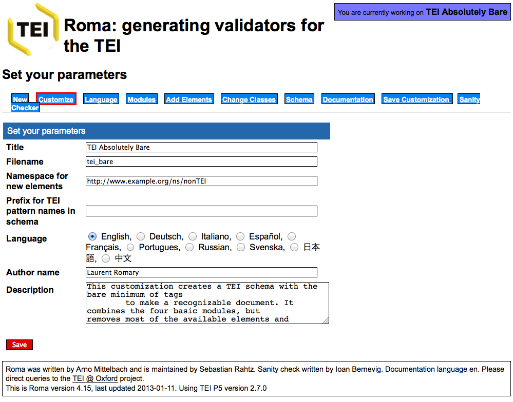
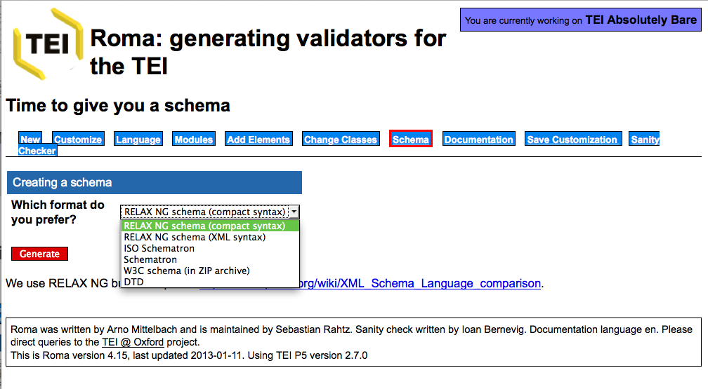
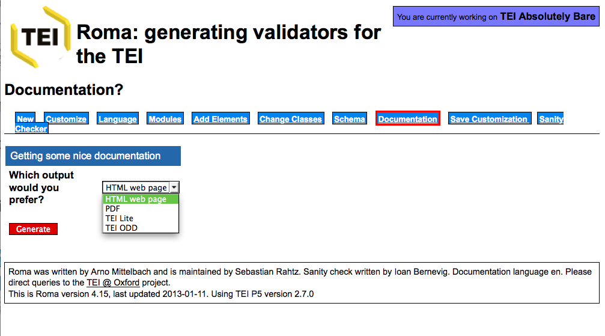
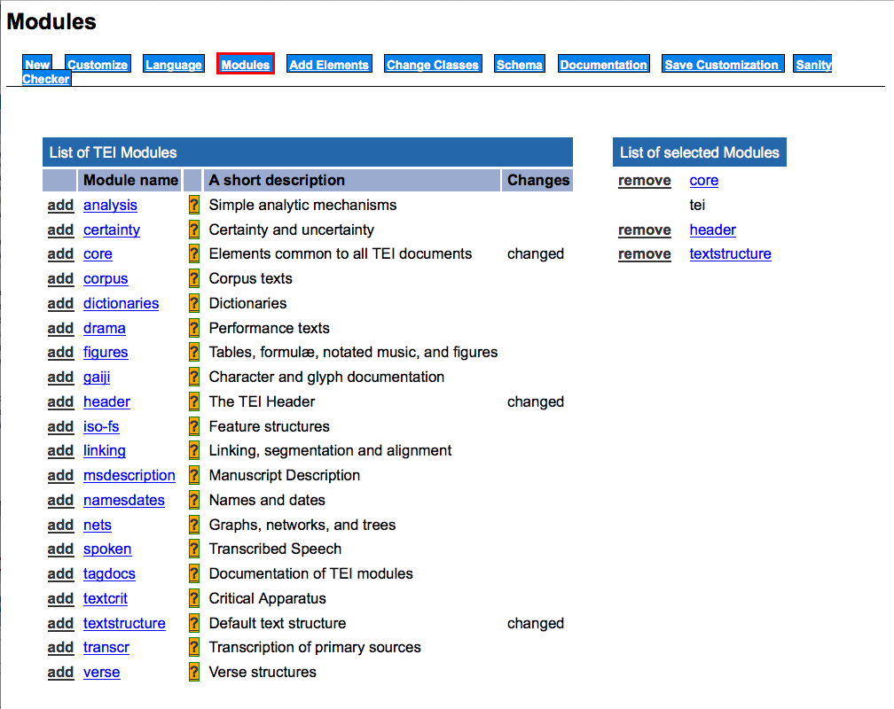
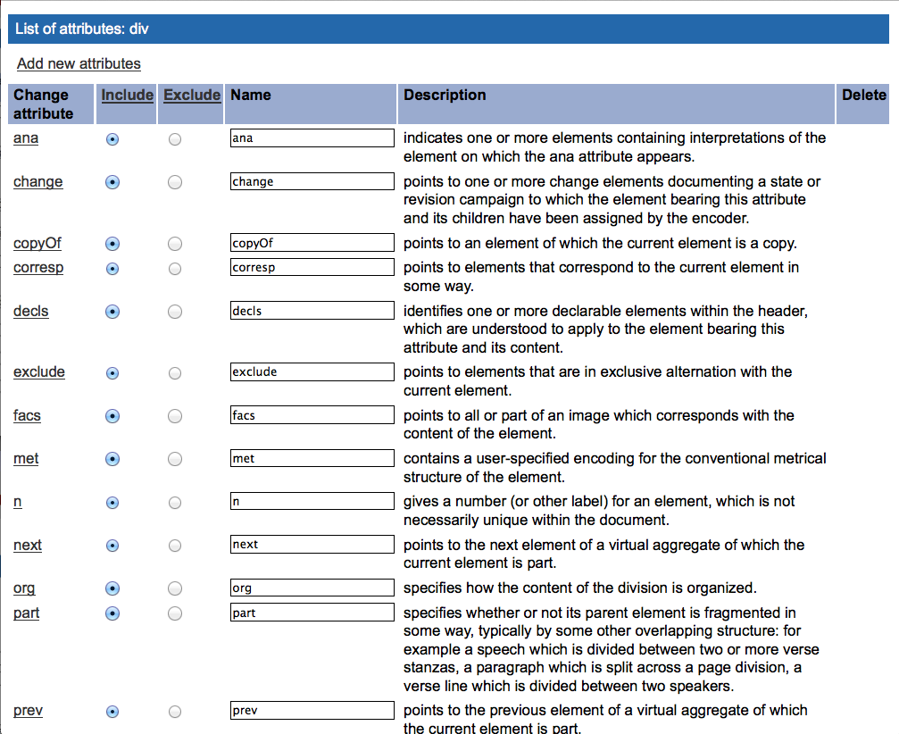
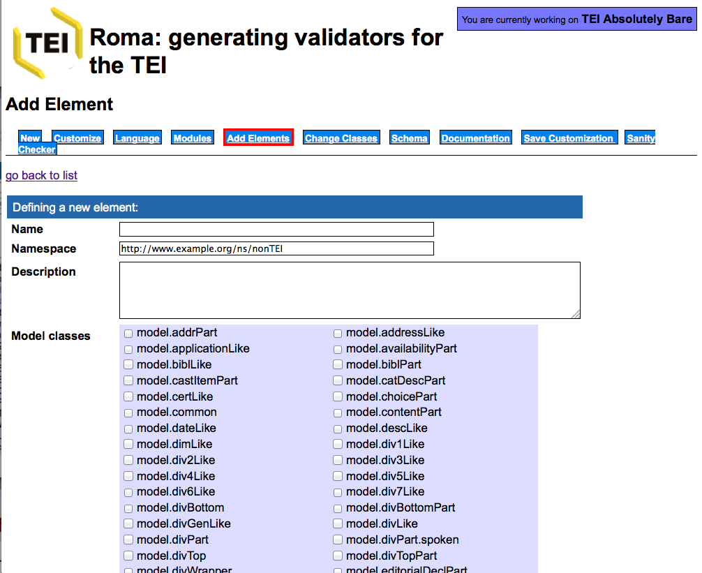
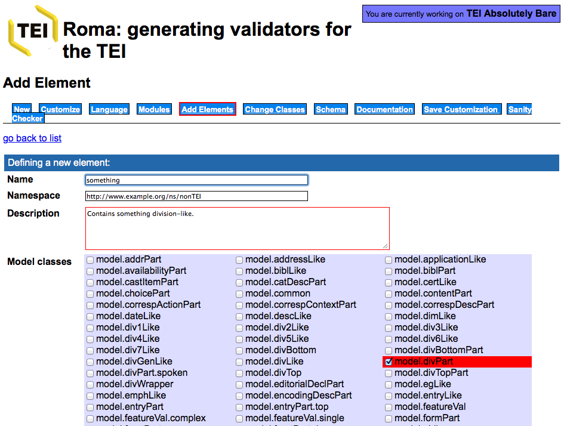

# Schema and customisation: producing valid TEI

The slides are based on those supplied by the various [Digital Humanities Summer Schools at the University of Oxford](http://digital.humanities.ox.ac.uk/dhoxss/) under the [Creative Commons Attribution](http://creativecommons.org/licenses/by/3.0/) license and have been adopted to the needs of the 2015 Introduction to TEI at DHSI.

Slides were produced using [MultiMarkdown](http://fletcherpenney.net/multimarkdown/), [Pandoc](http://johnmacfarlane.net/pandoc/), [Slidy JS](https://www.w3.org/Talks/Tools/Slidy/slidy.js), and the [Snippet](http://steamdev.com/snippet/) jQuery Syntax highlighter.

# Customising the TEI

We will cover: <!-- check these claims against the final syllabus -->

- How the TEI is constructed
- Making a TEI schema
- Specifying your profile of the TEI
- Generating your own documentation

**Every** use of the TEI involves making use of a customisation of the TEI.

# Terminology again

- The TEI encoding scheme consists of a number of *modules*
- Each module contains a number of *element specifications*
- Each element specification contains:
    + a canonical name (`<gi>`) for the element, and optionally other names in other languages
    + a canonical description (also possibly translated) of its function
    + a declaration of the *classes* to which it belongs
    + a definition for each of its *attributes*
    + a definition of its *content model*
    + usage examples and notes
- a TEI *schema* specification (`<schemaSpec>`) is made by selecting modules or elements and (optionally) modifying their contents
- a TEI document containing a schema specification is called an *ODD* (One Document Does it all)

# What is a module?

- A convenient way of grouping together a number of element declarations
- These are usually on a related topic or specific application
- Most chapters of P5 focus on elements drawn from a single module, which that chapter then defines
- A TEI Schema is created by selecting modules and adding or removing elements from them as needed

# Which modules are available?

<!-- mark those that we might need -->

Module name | Chapter of the P5
-|-
analysis |  Simple analytical mechanisms
certainty | Certainty and responsibility
core | Elements available in ALL TEI documents
corpus | Language corpora
dictionaries | Dictionaries
drama | Performance texts
figure | Tables, formulae, and graphics
gaiji | Representation of non-standard characters and glyphs
header | the TEI header
iso-fs | Feature structures
linking | Linking, segmentation, and alignment
msdescription | Manuscript description
namesdates | Names, dates, people, and places
nets | Graphs, networks, and trees
spoken | Transcription of speech
tagdocs | Documentation elements
tei | the TEI infrastructure
textcrit | Critical apparatus
textstructure | Default text structure
transcr | Representation of primary sources
verse | verse

# How do you choose?

- Just choose everything (not really a good idea)
- The TEI provides a small set of predefined combinations (TEI Lite, TEI Bare...)
- Or you could roll your own (but then you need to know what you're choosing)

Here comes <hi style="color:red">Roma</hi> a command line script, with a web frontend, designed to make this process much easier [http://www.tei-c.org/Roma/](http://www.tei-c.org/Roma/)

# Roma: design a new schema

# Roma: customise

# Roma: schema

# Roma: documentation

# What did we just do?

We processed a pre-existing ODD file which contained (as well as some discursive prose) the following schema specification:

    <schemaSpec ident="tei_bare" start="TEI">
        <moduleRef key="core"/>
        <moduleRef key="tei"/>
        <moduleRef key="header"/>
        <moduleRef key="textstructure"/>
        <elementSpec ident="abbr" mode="delete" module="core"/>
        <elementSpec ident="add" mode="delete" module="core"/>
        <!-- ... -->
        <elementSpec ident="trailer" mode="delete" module="textstructure"/>
        <elementSpec ident="title" mode="change" module="core">
            <attList>
                <attDef ident="level" mode="delete"/>
            </attList>
        </elementSpec>
        <!-- ... -->
    </schemaSpec>

We selected four modules, deleted loads of elements, and also deleted an attribute.

# Roma provides an interface to the detail

- The [Modules] tab shows the modules available
- Selecting a module from it shows the elements within that module, and gives you the choice to
    + include all of them (and then remove some)
    + exclude all of them (and then put back the ones you want)
- You can also change an element's attribute list, and the values they permit

# Roma: select modules

# Roma: edit modules

# What do we need for our newspaper?

A simple selection of elements, but also

- we want only only certain values of `@type` on `
`, for instance, "section", "article", "masthead", "verse", "bill"
- we may want to provide a list of suggested values for `@xml:lang`, such as, "ar", "ar-Latn-x-ijmes", "ota", "ota-Latn-x-ijmes", "en", "fr" etc.
- we may want to create a new element (do we? what would that be?)

Other constrains are possible--we might want to insist that a `
` contains only `
` and `
` and that the latter should be numbered through a `@n` attribute

# The ODD advantage

We can express these constraints in our ODD meta-schema, and then generate a formal schema to enforce them using whichever schema language we like.

- TEI schemas can be generated in
    + ISO RELAX NG language
    + W3C Schema Language
    + XML DTD language
- ODD itself defines an element's content models using a subset of RELAX NG syntax
- Datatypes are defined in terms of W3C datatypes
- Some facilities (e.g. alternation, namespaces) cannot be expressed in DTDs--RELAX NG schema is recommended
- Additional constraints can be expressed in Schematron

# Roma: select attributes

# Roma: constrain attribute values

# What did we just do?

Our ODD now includes something like this:

    <elementSpec ident="div" mode="change" module="textstructure">
        <attList>
            <attDef ident="type" mode="change" usage="req">
                <valList mode="replace" type="closed">
                    <valItem ident="section"/>
                    <valItem ident="article"/>
                    <valItem ident="verse"/>
                    <valItem ident="masthead"/>
                    <valItem ident="bill"/>
                    <valItem ident="letter"/>
                    <!-- ... -->
                </valList>
            </attDef>
        </attList>
    </elementSpec>

Note that we can also add documentation to the ODD

    <valItem ident="verse">
        <gloss>contains (parts of ) a poem</gloss>
    </valItem>

# Defining a new element

When defining a new element, we need to consider

- its name and description
- what attributes it can carry
- what it can contain
- where it can appear in a document

The TEI class system helps us answer all these questions (except the first).

# The TEI class system

- The TEI distinguishes over 500 elements,
- Having these organised into classes aids comprehension, modularity, and modification.
- *Attribute class*: the members share common attributes
- *Model class*: they can appear in the same locations (and are often semantically related)
- Classes may contain other classes
- An element can be a member of any number of classes, irrespective of the module it belongs to.

# TEI attribute classes

- Attribute classes are given (usually adjectival) names beginning with **att.**; e.g. att.naming, att.typed
- all members of att.naming inherit from it attributes `@key` and `@ref` ; all members of att.typed inherit from it `@type` and `@subtype`
- If we want an element to carry the `@type` attribute, therefore, we add the element to the att.typed class, rather than define those attributes explicitly.

# att.global: a very important attribute class

All elements are usually members of att.global; this class provides, among others:

- `@xml:id`: a *unique* identifier
- `@xml:lang`: thel anguage of the element content
- `@n`: a number or name for an element
- `@rend`: how the element in question was rendered or presented in the source text.

# Model Classes

- Model classes contain groups of elements which are allowed in the same place. e.g. if you are adding an element which is wanted wherever the `<bibl>` is allowed, add it to the `model.biblLike` class
- Model classes are usually named with a *Like* or *Part* suffix:
    + members of `model.pLike` are all things that ‘behave like’ paragraphs, and are permitted in the same places as paragraphs
    + members of `model.pPart` are all things which can appear within paragraphs. This class is subdivided into
        * `model.pPart.edit` elements for simple editorial intervention such as `<corr>`, `<del>` etc.
        * `model.pPart.data` ‘data-like’ elements such as `<name>`, `<num>`, `<date>` etc.
        * `model.pPart.msdesc` extra elements for manuscript description such as `<seal>` or `<origPlace>`

# Basic model class structure

Simplifying wildly, one may say that the TEI recognises three kinds of element:

- divisions:  high level major divisions of texts
- chunks: elements such as paragraphs appearing within texts or divisions, but not other chunks
- phrase-level elements: elements such as highlighted phrases which can occur only within chunks

There are ‘base model classes’ corresponding with each of these, and also with the following groupings:

- inter-level elements: elements such as lists which can appear either in or between chunks
- components: elements which can appear directly within texts or text divisions

And yes, there is a class `model.global` for elements that can appear anywhere inside a text — at any hierarchic level.

# Break

# Defining a new element

- What other elements is it like?
- What other elements can contain it?
- What can it contain?
- Conclusions:
    + What model do we select?
    + What content model do we select?

# Roma: Defining a new element

# Defining a content model

- A typical TEI element defines its content by referencing classes of element which it can contain, rather than using specific elements.
- Content models are defined using the RELAXNG vocabulary
- Here are some very common predefined content models:
    + macro.paraContent content of paragraphs and similar elements
    + macro.limitedContent content of prose elements that are not used for transcription of extant materials
    + macro.phraseSeq a sequence of character data and phrase-level elements
    + macro.phraseSeq.limited a sequence of character data and those phrase-level elements that are not typically used for transcribing extant documents
    + macro.specialPara the content model of elements which either contain a series of component-level elements or else contain a series of phrase-level elements

# Roma: Defining a new element 2

# What did we just do?

We added a new element specification to our ODD, like this:

    <elementSpec ident="something" mode="add" ns="http://www.example.org/ns/nonTEI">
        <desc>contains something division like.</desc>
        <classes>
            <memberOf key="model.divPart"/>
            <memberOf key="att.typed"/>
        </classes>
        <content>
            <rng:ref name="someThing"/>
            <rng:oneOrMore>
                <rng:ref name="model.pLike"/>
            </rng:oneOrMore>
        </content>
    </elementSpec>

Note that this new element is not in the TEI namespace. It belongs to this specific project only!

# Other kinds of constraints

- You can also constrain the content of an element or the value of an attribute to be of a particular datatype (for example, to insist that the `@when` attribute of the element `<date>` contains only a date)
- This can be done by using one of a set of predefined macros to define the content. Examples include
    + `data.word` a single word or token
    + `data.name` an XML Name
    + `data.enumerated` a single XML name taken from a documented list
    + `data.temporal.w3c` a W3C date
    + `data.truthValue` a truth value (true/false)
    + `data.language` a human language
    + `data.sex` human or animal sex
- Or you can define a more complex constraint, e.g. using
Schematron

# Schematron constraints

An element specification can also contain a `<constraintSpec>` element which contains rules about its content expressed as ISO Schematron constraints

    <elementSpec ident="div" mode="change" module="teistructure" xmlns:s="http://purl.oclc.org/dsdl/schematron">
        <constraintSpec ident="div" scheme="isoschematron">
            <constraint>
                <s:assert test="@type='bill' and .//tei:div[@type='article']">prose must include a paragraph</s:assert>
            </constraint>
        </constraintSpec>
    </elementSpec>

However...
- You can only add such rules by editing your ODD file: Roma doesn't know about them.
- Not all schema languages can implement these constraints.

# Next:

Let's try out Roma and define our own schema in order to *validate* our newly created TEI files

[http://www.tei-c.org/Roma/](http://www.tei-c.org/Roma/)