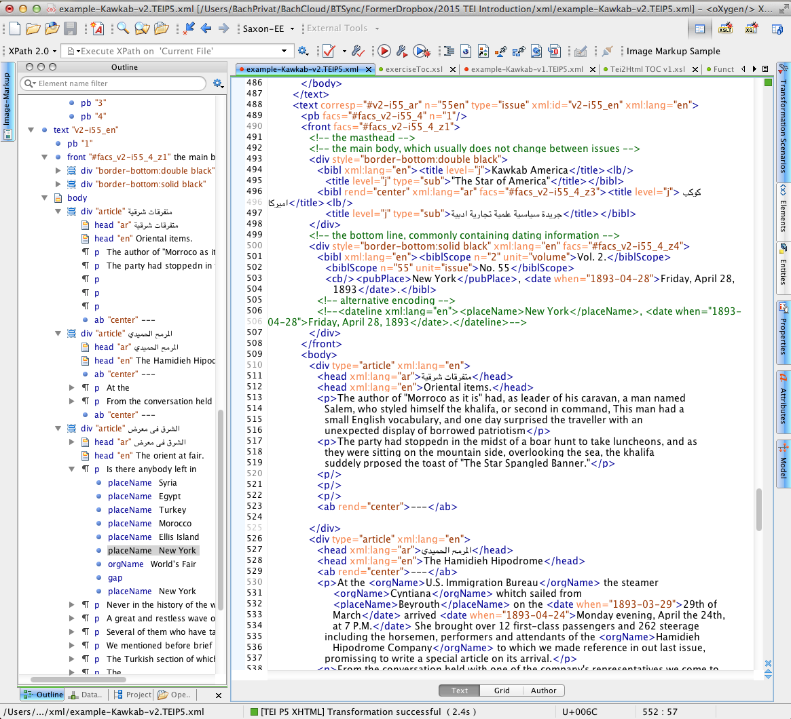
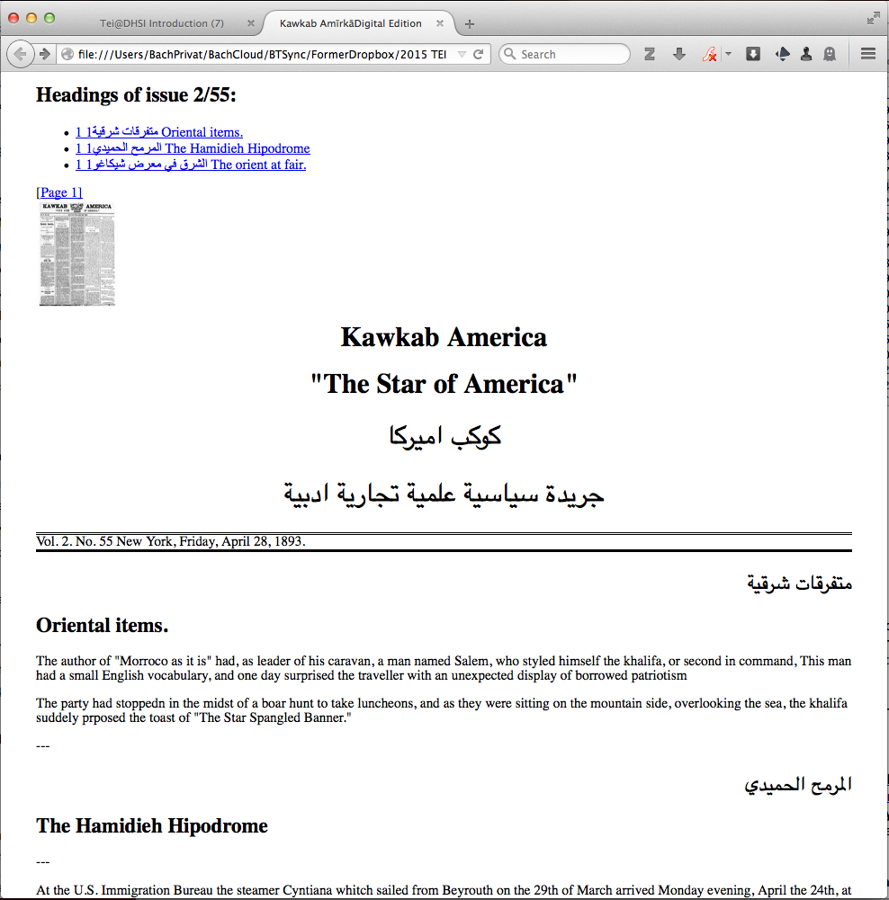

# Introduction

## Text Encoding Fundamentals and their Application

Dates and location: 1-5 June 2015, 9-12 and 1:30 to 4:30 at MacLaurin D016

Instructor: Till Grallert, OIB, <grallert@orient-institut.org>

General information on the schedule: [http://dhsi.org/schedule.php](http://dhsi.org/schedule.php) 

Course material: [http://tinyurl.com/dhsi2015tei](http://tinyurl.com/dhsi2015tei); password "dhsiUvic2015tei" (due to some of the images being copyrighted). The PDF course pack is available at [http://goo.gl/6rSeFd](http://goo.gl/6rSeFd).

Slides were produced using [MultiMarkDown](http://fletcherpenney.net/multimarkdown/), [Pandoc](http://johnmacfarlane.net/pandoc/), and [Slidy JS code](https://www.w3.org/Talks/Tools/Slidy/slidy.js).

# Goals:

By the end of this week you'll have a basic knowledge of

- XML
- TEI P5
- oXygen
- XPath
- XSLT
- and a tiny bit of HTML and CSS

You will also have encountered multilingual source material and transcriptions, including Arabic.

# Goals:

... or, in less giberish terms, of 

- data capture / recording in XML
- data modelling following the TEI
- data analysis and transformation through XSLT
- presentation of your data (on the web using HTML and CSS)

# Goals:

... or, since a picture is worth more than a thousand words, as the saying goes, how to get from the paper copies in front of you ...

# Goals:

... to this ...

# Goals:

... and finally to that:

<!-- 
# Goals:

You will also have seen four different early-twentieth century newspapers from Beirut--*al-Bashīr*, *al-Iqbāl*, *Lisān al-Ḥāl*, and *Thamarāt al-Funūn*--and their reaction to the Young Turk Revolution and the restoration of the Ottoman constitution in July 1908. In addition, you will have encountered three different Arabic translations of that very constitution.
-->

# Tentative schedule

The schedule is preliminary and tentative and we'll adopt it to the needs and the tempo of the course:

- Day 1: Introducing the game of XML and TEI
- Day 2: Data capture and organisation
- Day 3: Retrieving and displaying your data 
- Day 4: Enriching your data with names and named entities
- Day 5: Facsimile linking

# Day 1: Introduction to the game

## 1 Morning Session, 9-12

- Introductory round
- [Lecture 1: Introduction to XML and TEI](TeiDhsi-Session01-TeiXml-Slidy.html)
- Introduce our sources / examples
- Exercise 1: first look at actual XML files

## 2 Afternoon Session, 1:30-3:45

- [Lecture 2: core module / structural mark-up](TeiDhsi-Session02-TeiCoreModule-Slidy.html)
- Exercise 2a: contemplate the structure of newspaper texts (pen and paper)

# Day 2: data capture and organisation

## 3 Morning Session, 9-12

- Exercise 2b: 
    + data entry / structural mark-up
    + produce *well-formed* XML
- [Lecture 3: customisation / schemas](TeiDhsi-Session03-SchemaCustomization-Slidy.html)
- Exercise 3: schema customisation
    + produce our own schema and validate our files against it
    + produce *valid* TEI XML

## 4 Afternoon Session, 1:30-4:30

- [Lecture 4: metadata](TeiDhsi-Session04-TeiMetadata-Slidy.html)
- Exercise 4: enrich our examples with relevant metadata

# Day 3: retrieving and displaying data

## 5 Morning Session, 9-12

- [Lecture 5: introduction to XPath and XSLT](TeiDhsi-Session05-XpathXslt-Slidy.html)
- Exercise: XSLT
    + produce a toc

## 6 Afternoon Session, 1:30-4:30

- Continue exercise from morning session: XSLT 
    + produce a toc
    + produce a HTML view of our XML files
- Having a look at TEI Boilerplate

# Day 4: names and named entities

## 7 Morning Session, 9-12

- [Lecture 6: names, people, places, and dates](TeiDhsi-Session06-SemanticMarkUp-Slidy.html)
- XML Exercise: Semantic mark-up
- XSLT Exercise: include semantic mark-up in HTML output

## 8 Afternoon Session, 1:30-4

- [Lecture 7: Ontologies of named entities, linking](TeiDhsi-Session07-Ontologies-Slidy.html)
- XSLT Exercise: retrieve lists of names
- XML/ XSLT Exercise: link names to ontologies in the teiHeader
- XML Exercise: link to external authorities

# Day 5: Facsimile linking and wrap-up

## 9 Morning Session, 9-12

- [Lecture 8: Facisimile linking](TeiDhsi-Session08-FacsimileLinking-Slidy.html)
- XML Exercise: link `<pb>`s to facsimiles
- XSLT Exercise: retrieve the image links and display them in the HTML output

## 10 Afternoon Session, 1:30-2:30

- presentation of results
- group discussion
- wrap-up

# Useful links

(this slide will come up again)

- the TEI Consortium's [website](http://www.tei-c.org/index.xml) at http://www.tei-c.org/index.xml:
    + the [TEI guidelines](http://www.tei-c.org/Guidelines/P5/) at http://www.tei-c.org/Guidelines/P5/
    + [TEI by Example](http://www.teibyexample.org/TBE.htm) at http://www.teibyexample.org/TBE.htm
    + the TEI mailing list, <TEI-L@LISTSERV.BROWN.EDU>
    + the [TEI wiki](http://wiki.tei-c.org/index.php) at http://wiki.tei-c.org/: comprising inter alia [TEI cheatsheets](http://wiki.tei-c.org/index.php/TEI_Cheatsheets) at http://wiki.tei-c.org/index.php/TEI_Cheatsheets.
- Further resources provided by the TEI council and Oxford computing centre: 
    + [ROMA](http://www.tei-c.org/Roma/) at [tei-c.org/Roma/](http://www.tei-c.org/Roma/): customising TEI schemas for XML validation
    + [OxGarage](http://oxgarage.oucs.ox.ac.uk:8080/ege-webclient/) at http://oxgarage.oucs.ox.ac.uk:8080/ege-webclient/: online resource for conversion between common file formats, using TEI P5 as pivot format. Can be used to produce TEI P5 XML from a .docx file.
    + [DHOxSS](http://digital.humanities.ox.ac.uk/dhoxss/) at http://digital.humanities.ox.ac.uk/dhoxss/: providing the material (including slides and exercises) for years of summer schools.
- [TEI Boilerplate](http://dcl.ils.indiana.edu/teibp/) at [teiboilerplate.org/](http://teiboilerplate.org/): a light-weight solution for publishing styled TEI P5 content directly in modern web browsers (the implementation uses XSL which is processed by the browser).